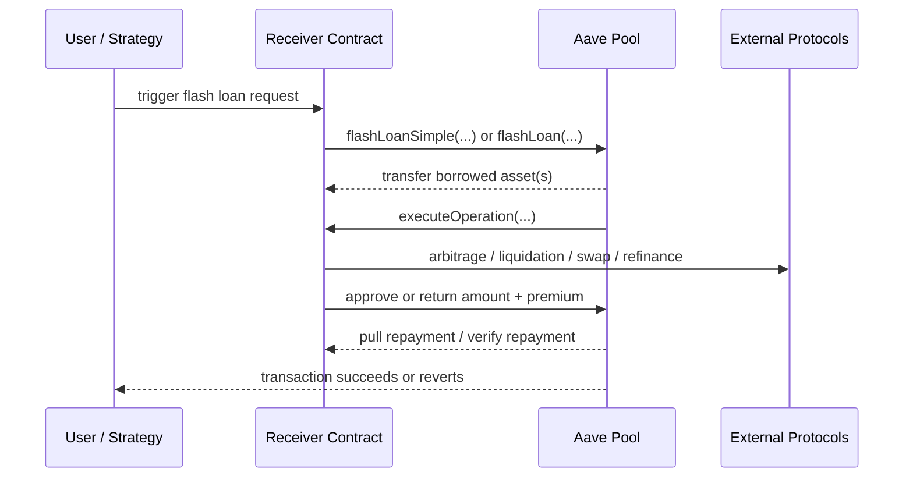
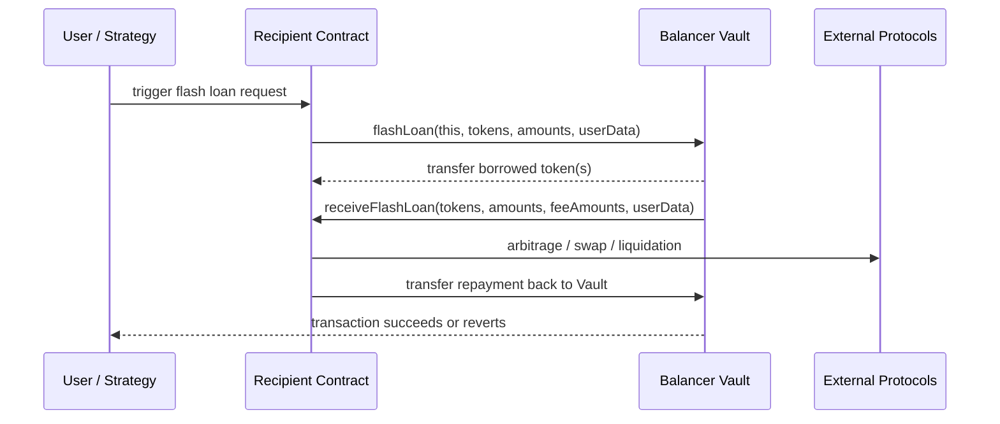
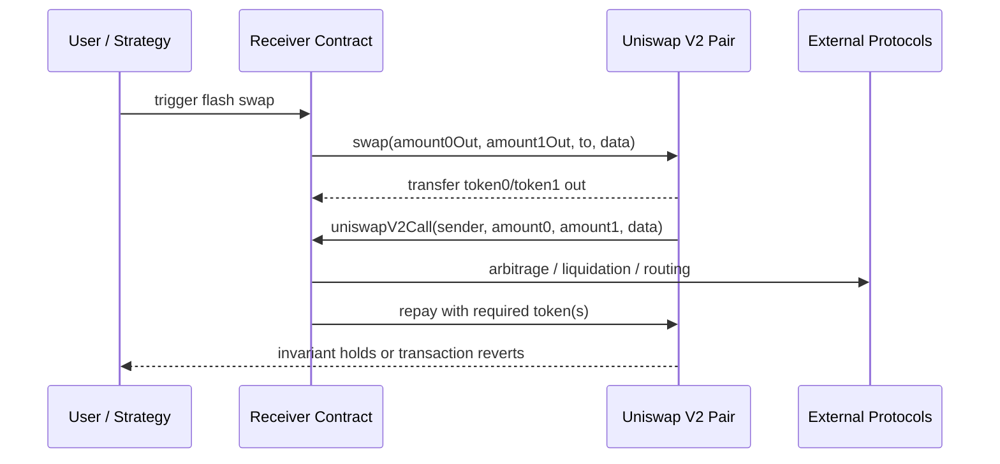

# 第二阶段：背景研究与规则定义

适用阶段：2026 年 3 月 11 日 - 3 月 15 日  
对应任务：阅读协议文档、总结交互流程、画交互图、写第一版检测规则、整理参考文献。

## 1. 本阶段的目标

这一步的目标不是马上跑全链数据，而是先把下面 4 个问题定义清楚：

1. 闪电贷在不同协议里的执行路径是什么。
2. 我们怎样给“闪电贷交易”下一个工程上可执行的定义。
3. 我们后续要从哪些链上信号中识别候选交易。
4. 哪些边界情况需要先排除，否则误报会很高。

## 2. 总体定义

从项目实现角度，建议把“闪电贷交易”定义为：

- 在单笔以太坊交易中，协议先向接收者转出资产。
- 接收者在回调函数中执行自定义逻辑。
- 该交易在结束前完成归还，或者恢复协议要求的不变量。
- 如果不满足归还条件，整笔交易回滚。

这个定义是根据 Aave、Balancer、Uniswap V2 的官方接口和文档归纳出来的工程定义，不是逐字照搬某一份文档。

## 3. 协议背景总结

### 3.1 Aave

Aave 的核心特征：

- Aave Pool 暴露 `flashLoan(...)` 和 `flashLoanSimple(...)` 两类入口。
- `flashLoan(...)` 支持多资产。
- `flashLoanSimple(...)` 支持单资产，接口更简单。
- 接收者需要实现回调函数 `executeOperation(...)`。
- 接收者在回调中执行自定义逻辑，并保证 Pool 能拿回本金和 premium。

对本项目最关键的接口信号：

- `IPool.flashLoan(...)`
- `IPool.flashLoanSimple(...)`
- `IFlashLoanSimpleReceiver.executeOperation(...)`
- `FlashLoan` event

需要特别注意的边界：

- Aave 的 `flashLoan(...)` 接口允许通过 `interestRateModes` 打开债务头寸。
- 这意味着并不是所有 `flashLoan(...)` 调用都符合“严格意义上的同交易归还”。
- 因此，第一版检测器建议把 `flashLoanSimple(...)` 和 `flashLoan(...)` 中 `interestRateModes=0` 的情况作为严格闪电贷；其余情况单独标记或先排除。

这是一个重要的工程判断，来源于 Aave 官方接口说明中对 `interestRateModes` 的定义。

### 3.2 Balancer V2

Balancer V2 的核心特征：

- Balancer 将大量池子的资产集中到同一个 Vault 中管理。
- Vault 直接提供 `flashLoan(...)` 功能。
- 借款接收者需要实现 `receiveFlashLoan(...)`。
- 官方文档当前写明 Balancer V2 flash loan 费用为 `0`。

对本项目最关键的接口信号：

- `IVault.flashLoan(...)`
- `IFlashLoanRecipient.receiveFlashLoan(...)`
- Vault 地址

工程上，Balancer 的检测难度相对低一些，因为：

- lender 地址集中在 Vault
- 回调函数名固定
- 借出和归还路径比较清晰

### 3.3 Uniswap V2 Flash Swaps

Uniswap V2 与前两者不同，它不是单独设计了一个“flashLoan”函数，而是在 `swap(...)` 机制里原生支持 flash swap。

核心特点：

- pair 合约先把输出 token 发给接收者。
- 如果 `data.length > 0`，pair 会把这次操作视为 flash swap。
- pair 之后会回调 `uniswapV2Call(address sender, uint amount0, uint amount1, bytes data)`。
- 接收者在回调里完成套利、清算或其他逻辑。
- 交易结束前必须让 pair 满足其要求，否则整笔交易回滚。

工程上，Uniswap V2 的难点在于：

- 它不叫 flash loan，而叫 flash swap。
- 仅靠事件不容易稳定识别。
- 更可靠的信号通常来自 `swap(...)` 输入参数、`data.length > 0`、回调调用和还款路径。

## 4. 三个协议的交互图

### 4.1 Aave 交互图

### 4.2 Balancer V2 交互图

### 4.3 Uniswap V2 Flash Swap 交互图

## 5. 第一版检测规则

下面的规则是为“项目中的可实现检测器”设计的，不是协议的正式定义。  
这些规则是根据官方接口、回调模式和事务原子性要求做出的实现推断。

### 5.1 总体检测思路

建议把检测分成两层：

1. 候选交易识别
   - 先用已知协议入口函数、已知 lender 地址、关键事件或关键回调筛出候选交易。

2. 精确验证
   - 对候选交易做 trace 或内部调用分析，确认是否存在“借出 -> 回调 -> 归还/恢复不变量”的完整链路。

### 5.2 通用规则

所有协议共用的第一版规则：

- 规则 G1：交易必须触达已知 lender 合约或已知 pair 合约。
- 规则 G2：交易中必须存在 lender/pair 向接收者的资产转出。
- 规则 G3：交易中必须出现协议定义的回调入口，或者出现等价的内部回调行为。
- 规则 G4：交易结束前必须观察到归还动作，或者观察到协议不变量恢复。
- 规则 G5：交易应当是成功交易。失败交易可以保存在候选集合中，但不要和最终样本混在一起。

### 5.3 Aave 检测规则

#### 候选规则

- A1：顶层调用命中 `flashLoan(...)` 或 `flashLoanSimple(...)`。
- A2：交易日志中出现 Aave `FlashLoan` event。
- A3：交易 trace 中出现对 receiver 的 `executeOperation(...)` 回调。

#### 验证规则

- A4：Pool 向 receiver 转出借出的资产。
- A5：receiver 回调执行完成后，Pool 能收回 `amount + premium`。
- A6：如果使用的是 `flashLoan(...)`，仅将 `interestRateModes=0` 的记录纳入“严格闪电贷”主数据集。
- A7：如果 `interestRateModes` 为 1 或 2，则打上 `debt-opened` 标签，默认不计入严格闪电贷统计。

#### 推荐实现备注

- 第一版最好优先支持 `flashLoanSimple(...)`。
- `flashLoan(...)` 的多资产分支和债务分支都更复杂，适合第二轮扩展。

### 5.4 Balancer V2 检测规则

#### 候选规则

- B1：交易调用 Balancer Vault 的 `flashLoan(...)`。
- B2：交易 trace 中出现 `receiveFlashLoan(...)`。
- B3：交易涉及官方 Vault 地址。

#### 验证规则

- B4：Vault 向 recipient 转出一组 token 和 amount。
- B5：Vault 在同一笔交易中回调 `receiveFlashLoan(...)`。
- B6：recipient 在回调后向 Vault 归还相应 token。
- B7：如果存在 `feeAmounts`，记录费用；如果费用为 0，也要显式记录为 0，不要留空。

#### 推荐实现备注

- Balancer V2 的 Vault 地址集中，是很好的切入点。
- 如果后续时间紧，优先做 Balancer + Uniswap V2，也能构成一套完整分析。

### 5.5 Uniswap V2 检测规则

#### 候选规则

- U1：交易调用 pair 的 `swap(...)` 且 `data.length > 0`。
- U2：交易 trace 中出现 `uniswapV2Call(...)`。
- U3：交易中 pair 先转出 token，再在后续调用中接收归还资产。

#### 验证规则

- U4：pair 先向 `to` 地址转出 `amount0Out` 或 `amount1Out`。
- U5：pair 回调 `uniswapV2Call(sender, amount0, amount1, data)`。
- U6：回调结束前，pair 收到足够的补偿资产，交易最终成功。
- U7：由于 Uniswap V2 支持用另一侧 token 完成“补偿”，第一版验证不能只看“借出 token 是否原样归还”，还应结合 pair 的输入流和交易成功状态判断。

#### 推荐实现备注

- 仅靠 Swap 事件会有较高误报。
- Uniswap V2 的可靠识别应优先依赖 trace 和函数输入，而不是只看日志。

## 6. 第一版数据字段建议

为了支持后续分析，第二阶段就应该把数据字段想清楚。建议至少保留：

- `tx_hash`
- `block_number`
- `timestamp`
- `protocol`
- `lender_address`
- `receiver_address`
- `initiator_address`
- `borrowed_token`
- `borrowed_amount`
- `fee`
- `callback_function`
- `success`
- `strict_flash_loan`
- `notes`

如果支持多资产，再扩展成：

- `borrowed_tokens`
- `borrowed_amounts`
- `repaid_tokens`
- `repaid_amounts`

## 7. 抽样验证建议

在真正开始大规模采集前，建议先手工验证 20 到 50 笔：

- 10 笔 Aave
- 10 笔 Balancer
- 10 笔 Uniswap V2
- 其余作为边界样本

人工检查时重点看：

- lender 是否真实转出了资产
- 是否真的触发了协议定义的回调
- 是否在同一交易里归还或恢复协议要求
- 是否属于套利、清算、债务置换等典型用途
- 是否是误报

## 8. 建议本阶段的直接产出

第二阶段结束时，建议你们至少产出下面这些内容：

1. 一份背景研究文档，也就是当前这份文件。
2. 三张可直接放进报告或 slides 的交互图。
3. 一版可执行的检测规则说明。
4. 一份参考文献清单。
5. 一页“边界情况说明”，避免后续采集时定义漂移。

## 9. 参考文献与资料

下面优先列官方资料，再列论文。

### 9.1 官方资料

1. Aave V3 `IPool` interface（官方仓库）  
   链接：<https://raw.githubusercontent.com/aave/aave-v3-core/master/contracts/interfaces/IPool.sol>

2. Aave V3 `IFlashLoanSimpleReceiver` interface（官方仓库）  
   链接：<https://raw.githubusercontent.com/aave/aave-v3-core/master/contracts/flashloan/interfaces/IFlashLoanSimpleReceiver.sol>

3. Balancer V2 Flash Loans（官方文档）  
   链接：<https://docs-v2.balancer.fi/reference/contracts/flash-loans.html>

4. Uniswap V2 Flash Swaps（官方文档）  
   链接：<https://docs.uniswap.org/contracts/v2/guides/smart-contract-integration/using-flash-swaps>

5. ERC-3156: Flash Loans（以太坊标准）  
   链接：<https://eips.ethereum.org/EIPS/eip-3156>

### 9.2 论文资料

6. Dabao Wang, Siwei Wu, Ziling Lin, Lei Wu, Xingliang Yuan, Yajin Zhou, Haoyu Wang, Kui Ren.  
   *Towards a first step to understand Flash Loan and its applications in DeFi ecosystem.*  
   Proceedings of the Ninth International Workshop on Security in Blockchain and Cloud Computing (SBC 2021), pages 23-28, 2021.  
   DOI：<https://doi.org/10.1145/3457977.3460301>

7. Zhiyang Chen, Sidi Mohamed Beillahi, Fan Long.  
   *FlashSyn: Flash Loan Attack Synthesis via Counter Example Driven Approximation.*  
   ICSE 2024.  
   IEEE 链接：<https://ieeexplore.ieee.org/document/10548683>  
   公开 PDF：<https://www.cs.toronto.edu/~fanl/papers/flashsyn-icse24.pdf>

## 10. 下一步建议

完成本文件后，下一步最合理的动作不是继续写更多背景，而是进入实现：

1. 先选择一个最容易做的协议作为第一实现目标。
2. 推荐优先顺序：Balancer V2 -> Aave `flashLoanSimple(...)` -> Uniswap V2。
3. 先做候选采集，再做 trace 验证。
4. 不要一开始就扫全链，先跑一个很小的时间窗口。

## 11. 给报告可直接复用的简短结论

如果你们现在就要写报告中的背景部分，可以直接复用下面这段表述：

Flash loan is a one-transaction borrowing mechanism that allows a user or a smart contract to temporarily access liquidity without upfront collateral, provided that the protocol can recover the required repayment before the transaction ends. In Aave and Balancer, this behavior is exposed through explicit flash loan interfaces and receiver callbacks. In Uniswap V2, the same idea appears as flash swaps, where the pair contract transfers assets first and verifies compensation only after the callback-based execution finishes. Based on these protocol-specific execution patterns, this project adopts a rule-based definition of flash loan transactions and uses protocol entrypoints, callbacks, and repayment paths as the primary signals for detection.
